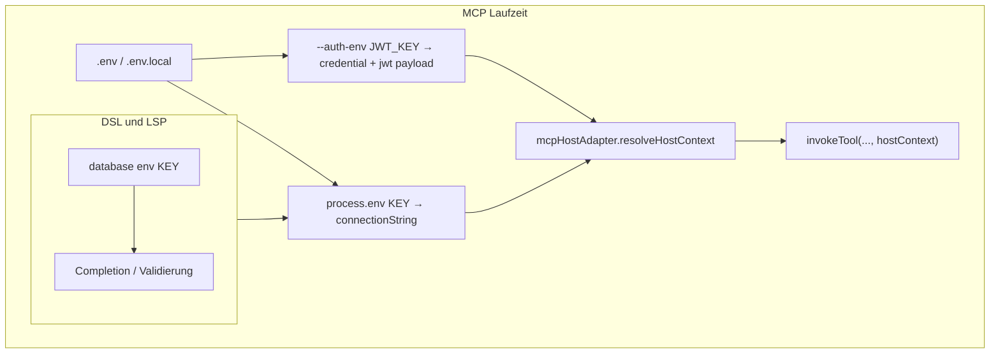

# db2ai: `@core2ai/mcp-host` mit DSL-DB-Key und JWT wie api2ai

## Klarstellung (vorheriges Missverständnis)

| Was | Wo | Rolle |
|-----|-----|--------|
| **Env-Key-Name** für die DB | DSL: `database env "PAGILA_DATABASE_URL"` | Single source of truth für LSP (Completion/Validierung in [`schema.ts`](file:///Users/annette/Documents/Projekte/MCP/db2ai/packages/language/src/schema.ts)), Codegen (`export const connectionEnv`), MCP Fail-fast |
| **Connection-String (Secret)** | `.env` / `.env.local` / `mcp.json` `env` | Laufzeitwert unter dem DSL-Namen — **nie** im DSL-Text |
| **User-Login / JWT** | MCP-Argv `--auth-env <NAME>` + Env-Wert | Wie api2ai: simuliert eingeloggten User; optional bis DSL später `requiresAuth` steuert |

Der DB-Key wird **nicht** über `--auth-env` an den MCP-Host übergeben (das wäre der alte Planfehler). In `mcp.json` steht der Pagila-Key **nicht** noch einmal in `args` — nur in der `.db2ai` und im generierten `connectionEnv`.

JWT über `--auth-env` **erhöht die Umsetzung kaum**: api2ai-Block [`renderMcpHostAdapterBlock`](file:///Users/annette/Documents/Projekte/MCP/api2ai/packages/cli/src/generator.ts) wird übernommen; db2ai ersetzt nur die `--base-url-env`-Pflicht durch die **aus der DSL eingebettete** `connectionEnv`-Konstante.



---

## Ausgangslage

| Aspekt | api2ai | db2ai (heute) |
|--------|--------|---------------|
| MCP-Bundle | core2ai `mcp-standalone-entry` | Fork `packages/cli/mcp-bundle/` |
| Host-Adapter | `--base-url-env` + optional `--auth-env`, JWT in `hostContext` | kein Adapter |
| DB-Key | OpenAPI/base URL | DSL `database env` (bereits für LSP) |

---

## 1. Build: Host aus core2ai bundeln

Unverändert gegenüber vorherigem Plan:

- [`db2ai/package.json`](file:///Users/annette/Documents/Projekte/MCP/db2ai/package.json): `bundle:mcp-runtime` → `../core2ai/packages/mcp-host/src/mcp-standalone-entry.ts`, `--external:pg` beibehalten.
- **`mcp-bundle/`** entfernen; `generate:pagila` + committed `generated/**` aktualisieren.

---

## 2. Codegen: Zwei-Schichten-`mcpHostAdapter`

Hauptdatei: [`packages/cli/src/generator.ts`](file:///Users/annette/Documents/Projekte/MCP/db2ai/packages/cli/src/generator.ts).

### 2a. `inputZodByTool`

- [`json-schema-to-zod-codegen.ts`](file:///Users/annette/Documents/Projekte/MCP/api2ai/packages/cli/src/json-schema-to-zod-codegen.ts) nach db2ai portieren (Typ `JsonSchemaDict` aus [`db-query-codegen.ts`](file:///Users/annette/Documents/Projekte/MCP/db2ai/packages/cli/src/db-query-codegen.ts)).
- `inputSchemaByTool` im generierten Modul entfernen (MCP braucht nur Zod).

### 2b. `connectionEnv` aus DSL (fix im generierten Modul)

Aus `model.env` (bereits in `generateOutput`):

```typescript
export const connectionEnv = "PAGILA_DATABASE_URL"; // exakt aus DSL-STRING
```

- Language/Validator: **keine DSL-Änderung** nötig — `database env` bleibt.
- LSP lädt weiter `resolveDatabaseUrlFromEnvForDocument(envName, documentUri)` — unabhängig vom MCP-Adapter.

### 2c. `mcpHostAdapter` — api2ai JWT + db2ai Connection

Neue Funktion z. B. `renderDbMcpHostAdapterBlock(connectionEnvLiteral, authKind)`:

| Teil | Verhalten |
|------|-----------|
| **`configureFromArgv`** | Nur `--auth-env <NAME>` (optional, wie api2ai). **Kein** `--base-url-env`. Unbekannte Flags wie api2ai ablehnen. |
| **`validateAtStartup`** | **Immer:** `process.env[connectionEnv]` gesetzt (Connection — Key aus DSL-Konstante, nicht aus argv). **Zusätzlich** wenn `requiresAuth === true`: JWT-Env aus `--auth-env` (api2ai-Logik). |
| **`resolveHostContext`** | `{ connectionString, credential?, jwt? }` — `connectionString` aus `process.env[connectionEnv]`; `credential`/`jwt` wie api2ai (`decodeJwtPayloadUnsafe` bei 3 Segmenten). |
| **`envDirsForReload`** | wie api2ai (`MCP_HOST_ENV_DIRS`) |

`authKind: 'none' | 'credential'` wie api2ai: bei `'credential'` fehlt JWT → Fehler in `resolveHostContext`; bei `'none'` optional.

**`requiresAuth` (erste Iteration):**

- Pagila-Demo: `export const requiresAuth = false` — MCP startet ohne `--auth-env`, JWT-Infrastruktur ist trotzdem im generierten Code.
- Später (optional, nicht Blocker): DSL-`auth`-Block analog api2ai → `requiresAuth = true` und `authKind = 'credential'`.

**Komplexität JWT:** gering — Copy/Paste des api2ai-Adapter-Strings mit Ersetzung von `baseUrl`/`META_BASE_URL_*` durch `connectionEnv`-Konstante + `connectionString`.

### 2d. `invokeTool` + Identität

- `invokeTool(toolName, options, hostContext?)` nutzt `hostContext.connectionString` für `pg.Client` (Fail-fast wenn fehlt).
- **Optional in Phase 1:** `hostContext.jwt` / `credential` noch nicht in SQL auswerten — nur durchreichen/exportieren für spätere Row-Level-Security oder Audit; kein Blocker.
- `mcpServerName` / `mcpServerVersion` wie api2ai.

---

## 3. Smoke und Root-Skripte

[`smoke.ts`](file:///Users/annette/Documents/Projekte/MCP/db2ai/packages/cli/src/smoke.ts):

- `loadLocalEnvFiles` aus `@core2ai/mcp-host`.
- `applySmokeHostEnv(adapter, { connectionString, credential? }, envDirs)`:
  - Connection: `process.env[imported.connectionEnv]` (DSL-Key aus Modul).
  - JWT: optional `adapter.configureFromArgv(['--auth-env', 'MCP_HOST_CREDENTIAL'], envDirs)` + Wert setzen (wie [`api2ai smoke-host-env.ts`](file:///Users/annette/Documents/Projekte/MCP/api2ai/packages/cli/test/integration/smoke-host-env.ts), ohne `--base-url-env`).

Root `test:mcp:pagila` — **ohne** DB-Key in argv:

```bash
node ./packages/extension/demos/generated/cli/mcp-serve.mjs \
  ./packages/extension/demos/generated/tools/pagila-tools.mjs
# optional später: --auth-env DB2AI_USER_JWT
```

`PAGILA_DATABASE_URL` kommt aus `.env.local` + DSL-Key im generierten Modul.

---

## 4. Demos und Cursor MCP

[`demos/.cursor/mcp.json`](file:///Users/annette/Documents/Projekte/MCP/db2ai/packages/extension/demos/.cursor/mcp.json) — **kein** `--auth-env PAGILA_DATABASE_URL`:

```json
"args": [
  "./generated/cli/mcp-serve.mjs",
  "./generated/tools/pagila-tools.mjs"
]
```

Secrets:

```json
"env": {
  "PAGILA_DATABASE_URL": "postgresql://..."
}
```

Optional für JWT-Tests (wenn `requiresAuth` / manuell):

```json
"--auth-env", "DB2AI_USER_JWT"
```

[`packages/cli/README.md`](file:///Users/annette/Documents/Projekte/MCP/db2ai/packages/cli/README.md): zwei Abschnitte — **DB-Key in `.db2ai`**, **JWT wie api2ai**.

---

## 5. Abhängigkeiten und Verifikation

- `@core2ai/mcp-host` in Smoke importieren; `@core2ai/codegen` optional entfernen (weiter ungenutzt).
- Verifikation: `langium:generate && npm run build`, `generate:pagila`, `test:smoke:pagila`, `test:mcp:pagila`.

---

## Bewusst nicht im Scope (jetzt)

- OpenAPI-`auth`-Header in HTTP-Requests (db2ai hat kein HTTP).
- DSL-`auth`-Keyword (kann später `requiresAuth` steuern — JWT-Adapter ist schon vorbereitet).
- `json-schema-to-zod-codegen` nach `@core2ai/codegen` verschieben.

## Optional später

- DSL: `auth env "USER_JWT"` → `requiresAuth = true`, dokumentierter `--auth-env`-Name aus DSL.
- `invokeTool` wertet `hostContext.jwt` für Mandantenfilter / Audit aus.
