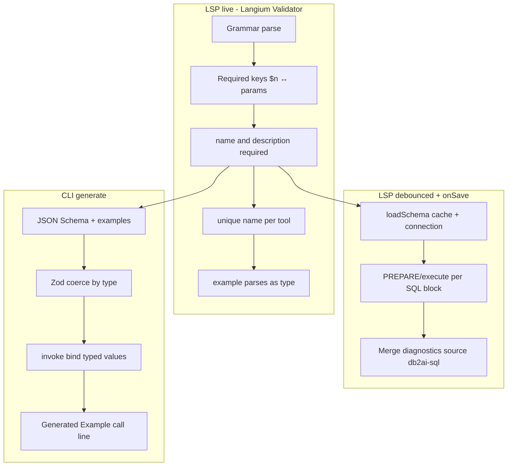

# db2ai: Strukturierte SQL-Parameter (`description` / `example` / `type`)

## Macht das Sinn?

**Ja** — die drei Felder trennen sauber, was heute in einem String steckt:

| Feld                                | Zweck                                                                                                           |
| ----------------------------------- | --------------------------------------------------------------------------------------------------------------- |
| `description`                       | Agent-Doku (ersetzt bisheriges `$1: "…"`)                                                                       |
| `example`                           | Konkrete Testwerte für DB-Validierung (PREPARE/Execute) und als Hinweis im Tool                                 |
| `type` (optional, Default `string`) | Korrektes MCP JSON Schema / Zod (`integer` für `LIMIT $2` statt alles `string`)                                 |
| `name` (**Pflicht**)                | MCP-/Invoke-Property (`rating`, `maxRows`) — **nicht** der SQL-Platzhalter; **kein** `param1`/`param2`-Fallback |

**Zwei Ebenen (wichtig):** In `query` bleiben nur **`$1`, `$2`, …`** (PostgreSQL/MySQL prepared). `$customer` in SQL ist **nicht** vorgesehen. `name:` ist der **JSON-Key** im MCP-Tool — immer explizit vom Autor.

**Für MCP-Tools:** JSON Schema pro Property mit `description`, `type`, optional [`examples`](https://json-schema.org/draft/2020-12/json-schema-validation.html#rfc.section.9.5) aus `example`; Param-Zeilen in der Tool-Beschreibung inkl. Beispielwert.

**Block-`example` auf `SQL { }` entfällt (v1):** Überlappt mit Param-`example`. Tool-Beschreibung: generierte Zeile `Example call: searchText=dragon, maxRows=15`. **`SELECT * FROM`-Blöcke** behalten `example:` (Pagination-Hinweis).

**Pflicht-`name`:** MCP-Schema und Invoke nutzen ausschließlich sprechende Keys (`rating`, `maxRows`). Kein `paramN`-Fallback. Validator: `name` fehlt → Error; **`name` pro `SqlQuery` global eindeutig** (z. B. zwei× `maxRows` in `$1` und `$2` → Error auf dem zweiten Eintrag); reserviert: `limit`, `offset`.

**Bindung:** Codegen mappt `options[name]` → `$n` in SQL-Reihenfolge.

**Einschränkung:** `example` beweist nur, dass _diese_ Werte funktionieren (z. B. Cast `rating::text`). Kein Ersatz für vollständige SQL-Analyse — reicht für euren Use Case.

---

## Ziel-Syntax (Breaking Change)

```db2ai
SQL {
    toolName: "searchFilms"
    intent: "search films by free text in title or description"
    query: "… $1 … LIMIT $2"
    summary: "Film full-text style search"
    params: {
        $1: {
            name: searchText
            description: "search text (matched in title or description)"
            example: "dragon"
            type: string
        }
        $2: {
            name: maxRows
            description: "max rows to return"
            example: "15"
            type: integer
        }
    }
}
```

- **Keine** alte Kurzform `$1: "…"` (Demos + Tests migrieren).
- **Kein** `example:` mehr im `SQL`-Block (nur noch bei `SELECT * FROM`).
- **`name` Pflicht** — gültiger Identifier (`ID` in Grammar), **eindeutig pro SQL-Tool**; kein `param1`-Fallback.
- **`description` Pflicht** — freier Fließtext für Agents.
- `example` **optional** (strukturell); **für DB-Check:** jedes `$n` in `query` braucht `example`, sonst Warning („DB validation skipped …“).
- `type`: optional, Default `string`; `example` muss zum Typ passen (live).

---

## Architektur



---

## 1. Grammar + AST

Datei: [`packages/language/src/db-2-ai-dsl.langium`](packages/language/src/db-2-ai-dsl.langium)

```langium
SqlParamEntry:
    placeholder=PARAM_REF ':' spec=SqlParamSpec;

SqlParamSpec:
    '{' (fields += SqlParamSpecField)* '}';

SqlParamSpecField:
    'name' ':' name=ID |
    'description' ':' description=STRING |
    'example' ':' example=STRING |
    'type' ':' paramType=SqlParamType;

SqlParamType returns string:
    'string' | 'integer' | 'number' | 'boolean';
```

Validator (nicht Grammar): pro Spec genau ein `name`, genau ein `description`; `example`/`type` optional. Completion-Snippet-Reihenfolge: `name`, `description`, `example`, `type`.

**SqlQuery:** `('example' ':' example=STRING)?` entfernen (nur `TableQuery` behält `example`).

Nach `langium:generate`: `SqlParamSpec` mit `fields`-Liste; `SqlParamEntry.spec` statt `label`.

---

## 2. Auflösung & Validator (schnell)

**[`packages/language/src/sql-params.ts`](packages/language/src/sql-params.ts)**

- `ResolvedSqlParam`: `propertyName` = `spec.name` (Pflicht); `description`, `example?`, `jsonSchemaType`. **`isValidMcpPropertyName`-Fallback aus `description` entfernen.**
- `resolveSqlParams` / `resolveSqlParamsOrdered` lesen aus `SqlParamSpec`.

**[`packages/language/src/db-2-ai-dsl-sql-validator.ts`](packages/language/src/db-2-ai-dsl-sql-validator.ts)**

- Pflicht `name` + `description` pro Param-Spec (fehlende Felder → Error auf `spec`).
- **`checkUniqueParamNames(sqlQuery)`:** alle `name`-Werte im `params`-Block sammeln; bei Duplikat Error auf dem späteren `SqlParamEntry` (`Duplicate param name "maxRows". Names must be unique within this SQL tool.`).
- Duplikat-`$n`-Mapping wie bisher.
- Neu: `parseExampleAsType(example, type)` → Fehler auf `example`, wenn nicht parsebar.

**Neu:** [`packages/language/src/sql-db-validator.ts`](packages/language/src/sql-db-validator.ts)

- `validateSqlBlocksWithExamples(model, documentUri): Promise<Diagnostic[]>`
- Pro `SqlQuery`: Connection aus `database env` + [`schema.ts`](packages/language/src/schema.ts).
- Postgres/MySQL wie Invoke; Fehler auf `query`, `source: 'db2ai-sql'`.

---

## 3. LSP: debounced + Save

**[`packages/extension/src/language/main.ts`](packages/extension/src/language/main.ts)** — Debounce ~2s + `onDidSave`; Diagnostics mergen.

**CLI** [`packages/cli/src/document-actions.ts`](packages/cli/src/document-actions.ts): `validateAction` inkl. DB-SQL-Check.

---

## 4. Completion (Reihenfolge `name` → `description` → `example` → `type`)

Datei: [`db-2-ai-dsl-completion-provider.ts`](packages/language/src/db-2-ai-dsl-completion-provider.ts) — analog zu `TABLE_BLOCK_KEYS` / `offsetInsideColumnMap`.

**Konstanten:**

```ts
const SQL_PARAM_SPEC_KEYS = ['name', 'description', 'example', 'type'] as const;
const SQL_PARAM_SPEC_SORT = { name: '0200', description: '0201', example: '0202', type: '0203' };
```

**SQL-Block:** `SQL_BLOCK_KEYS` ohne `example` → `['toolName', 'intent', 'query', 'summary', 'params']`.

**Innerhalb `SqlParamSpec` `{ … }`:**

- `offsetInsideSqlParamSpec(entry, offset)` (wie Column-Map).
- `usedSqlParamSpecFields(spec)` aus AST (`fields`-Liste).
- **Sequenziell:** Es wird nur das **nächste fehlende** Keyword vorgeschlagen (erstes Element in `SQL_PARAM_SPEC_KEYS`, das noch nicht gesetzt ist). So erscheint nie gleichzeitig `type` vor `description`; nach `description` kommt `example`, danach `type`. Optionale Felder überspringen: Autor tippt `type:` manuell.
- `sortText` = `SQL_PARAM_SPEC_SORT[key]` (falls mehrere Kandidaten, z. B. Prefix-Match auf halbem Keyword).
- Snippets: `name: $1`, `description: "$1"`, `example: "$1"`, `type: $1` (`type`-Snippet mit Choice `string|integer|number|boolean` optional).
- Neuer Eintrag `$1: { … }`: Snippet ganzer Spec in Reihenfolge:  
  `name: $1\ndescription: "$2"\nexample: "$3"\ntype: $4`.

**Tests:** [`completions.test.ts`](packages/language/test/completions.test.ts) — in leerem Param-Spec nur `name`; nach `name:` nur `description`; Reihenfolge der `sortText`/Labels.

---

## 5. Codegen / MCP

**[`packages/cli/src/db-query-codegen.ts`](packages/cli/src/db-query-codegen.ts)**

- `buildSqlInputSchema`: `type`, `examples` aus Param-Spec.
- `buildSqlDescription`: `Example call: searchText=dragon, maxRows=15` aus `propertyName` + `example` (ersetzt Block-`example`).
- `ResolvedSqlToolCodegen.example` entfernen oder nur aus Params ableiten.

**[`packages/cli/src/generator/invoke-render.ts`](packages/cli/src/generator/invoke-render.ts)** — typed bind.

---

## 6. Demos & Tests

- [`pagila.db2ai`](packages/extension/demos/pagila.db2ai): neue `params`-Syntax; `example:` aus allen `SQL`-Blöcken streichen.
- Sakila analog.
- [`sql-validating.test.ts`](packages/language/test/sql-validating.test.ts): Duplikat-`name` in einem Tool → Error.
- Tests + `npm run langium:generate && npm run build && npm run check`.

---

## Beispiel-Migration (searchFilms)

Vorher (redundant):

```db2ai
example: "Search dragon, limit 15"
params: { $1: "…", $2: "…" }
```

Nachher: siehe Ziel-Syntax oben; Tooltext endet mit `Example call: searchText=dragon, maxRows=15`.

**Pagila SQL-Tools (Vorschlag `name`):** `filmsByMpaaRating` → `rating`, `maxRows`; `filmsWithActorLastName` → `lastNamePrefix`, `maxRows`; `searchFilms` → `searchText`, `maxRows`.

**Tests/Invoke:** Integrationstests von `{ param1, param2 }` auf benannte Keys umstellen (z. B. `{ rating: 'PG', maxRows: 3 }`).

---

## Bewusst nicht in v1

- Benannte SQL-Platzhalter (`$customer`) — nur `$1`…`$n` in `query`
- SQL-Autocomplete im `query`-String
- Live DB-Validierung bei jedem Keystendruck
- Freitext-Block-`example` auf `SQL` (nur generiert)

---

## Risiken / Hinweise

- Debounce + Save begrenzen DB-Load.
- Postgres/MySQL zwei Pfade in `sql-db-validator`.
