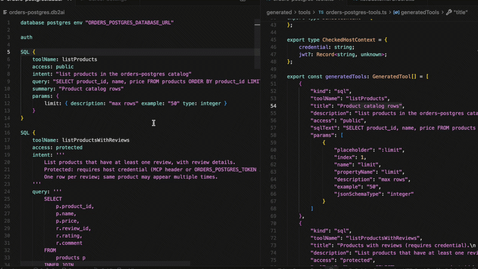

# db2ai

> **Pre-release** --- early access; APIs, DSL, and generated output may
> change before v1.0.

## Turn your database into AI-ready tools.

Generate MCP-compatible tools from SQL queries without writing custom MCP
servers.

db2ai lets you define SQL-based tools, enrich them with AI-friendly metadata,
and generate MCP tools that can be used by AI agents.

Perfect for exposing existing business data to Claude, ChatGPT, Cursor, and
other MCP-compatible runtimes.

---

## Get Started

The fastest way to try db2ai is with the VSIX extension and the bundled demo
workspace.

### 1. Install the VSIX

Download the [latest release](https://github.com/annettedorothea/db2ai/releases).

### 2. Create a Demo Workspace

Open Cursor or VS Code and run:

```text
db2ai: Create demo workspace (MCP examples)
```

### 3. Test your first MCP server

Open **`README.md`** in the demo folder and follow **Quick start** (`npm run start:sakila-mysql`, then MCP server `sakila-mysql`). Requires Docker Desktop.

No repository checkout required.

---

## Demo



The video shows:

- editing a `.db2ai` file and defining SQL tools with `access: public`,
  `protected`, and `validate`
- generating MCP tool modules and auth stubs on save
- implementing protected-access authorization in TypeScript (JWT claims, role
  checks)
- enabling the generated MCP server in Cursor and signing in to obtain a JWT
- calling the same tool as different users and observing allowed vs denied
  access

---

## Example

```db2ai
database postgres env "ORDERS_POSTGRESQL_DATABASE_URL"

auth

SQL {
    toolName: listCustomerOrders
    access: protected
    validate: {
        optionalParams: [customerId]
    }
    intent: '''
        List orders for a customer.
        When customerId is omitted, the value from the JWT is used.
        Checked access: customerId must match the token claim when provided.
    '''
    query: '''
        SELECT
            order_id,
            customer_id,
            product_id,
            quantity
        FROM
            orders
        WHERE
            customer_id = :customerId
        ORDER BY
            order_id
    '''
    summary: "Customer order rows"
    params: {
        customerId: {
            description: "Customer id (e.g. alice, bob). Defaults from JWT when omitted on protected tools."
            example: "alice"
            type: string }
    }
}
```

### Flow

```text
Database
    ↓
.db2ai
    ↓
MCP Tool
    ↓
AI Agent
```

---

## Why db2ai?

Building MCP tools for databases usually requires:

- writing SQL wrappers
- implementing tool definitions
- maintaining MCP server code
- keeping database access and tool descriptions in sync

db2ai lets you focus on describing business capabilities instead of writing
boilerplate.

Queries are validated against a live database using dry-run probes (`EXPLAIN` /
compile-only checks; no data changes) before tools are generated.

---

## Supported database dialects

- PostgreSQL
- MySQL
- MariaDB
- SQL Server
- Oracle

---

## Documentation

The architecture behind db2ai is documented in
[core2ai](https://github.com/annettedorothea/core2ai):

- [Tool Factory](https://github.com/annettedorothea/core2ai/blob/main/docs/01-layer-1-tool-factory.md)
- [Tool Authoring](https://github.com/annettedorothea/core2ai/blob/main/docs/02-layer-2-tool-authoring.md)
- [AI Runtime](https://github.com/annettedorothea/core2ai/blob/main/docs/03-layer-3-ai-runtime.md)
- [Personas](https://github.com/annettedorothea/core2ai/blob/main/docs/04-personas.md)

Overview: [core2ai docs](https://github.com/annettedorothea/core2ai/tree/main/docs)

---

## Related Projects

- [**core2ai**](https://github.com/annettedorothea/core2ai) --- shared runtime
  and code generation infrastructure
- [**api2ai**](https://github.com/annettedorothea/api2ai) --- generate MCP tools
  from OpenAPI specifications

---

## License

MIT — see [LICENSE](./LICENSE).

Integration, consulting, and support: open a [GitHub Discussion](https://github.com/annettedorothea/db2ai/discussions) or issue.

---

## Develop from source (without VSIX)

To run the extension from a git checkout instead of installing a release VSIX:

1. Check out the sibling [**core2ai**](https://github.com/annettodorothea/core2ai) repo as `../core2ai` and build it once:

```bash
cd ../core2ai && npm install && npm run build
```

2. From this repo root:

```bash
npm install
npm run langium:generate
npm run build
```

3. In VS Code or Cursor: **Run and Debug** → **Run db2ai Extension**. This opens
   [`packages/extension/demos`](./packages/extension/demos) in an Extension Development Host. The
   launch task runs `langium:generate` and `build` again before start.

To test MCP servers in that window (not only DSL editing and generate-on-save):

```bash
npm run install:demos
npm run build:generated --prefix packages/extension/demos
```

Then follow **Quick start** in [`packages/extension/demos/README.md`](./packages/extension/demos/README.md)
(Docker Desktop; `npm run start:sakila-mysql` or `npm run start`, enable MCP servers).

---

#Col3:23
